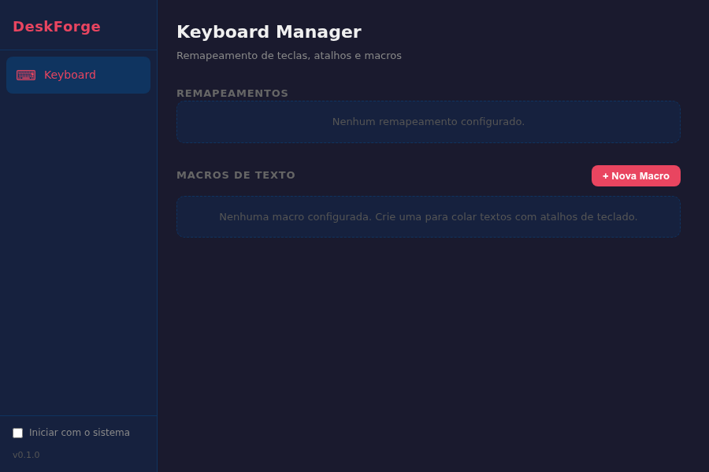

# DeskForge

Cross-platform desktop utility hub. Manage keyboard remappings, custom shortcuts, text macros, and more — from a single app.



## Features

### Keyboard Manager
- **Key remapping** — CapsLock to Escape toggle (more remaps coming)
- **Global shortcuts** — `Super+Escape` toggles CapsLock from any application
- **Text macros** — assign a key combo to paste custom text (via clipboard or simulated typing)
- **Popup overlay** — minimal notification at the bottom of the active monitor with fade animation
- **System tray** — always-on with status display, quick toggle, and show/quit menu
- **Autostart** — optional launch on login via XDG autostart

### How it works

Toggle CapsLock to Escape in 3 ways:
1. Toggle switch in the app UI
2. Click the tray icon menu
3. Press `Super+Escape` from anywhere

Create text macros:
1. Click "+ Nova Macro" in the app
2. Click "Gravar" and press your desired key combination
3. Type the text you want pasted
4. Choose method: clipboard (Ctrl+V) or simulated typing
5. Press the combo anywhere to paste

## Tech Stack

- **Backend:** Rust + Tauri 2.0
- **Frontend:** Svelte 5 + TypeScript
- **Config:** TOML (`~/.config/deskforge/config.toml`)
- **Platform:** Linux (Pop!_OS / GNOME) — Windows and macOS planned

## Prerequisites (Linux)

```bash
sudo apt install libwebkit2gtk-4.1-dev libgtk-3-dev libayatana-appindicator3-dev librsvg2-dev build-essential xdotool xclip
```

Rust (1.88+) and Node.js (18+) are also required.

## Development

```bash
git clone https://github.com/growsoftaware/deskforge.git
cd deskforge
npm install
npm run tauri dev
```

## Build

```bash
npm run tauri build
# Output: src-tauri/target/release/bundle/deb/deskforge_*.deb
```

## Config

Configuration is stored at `~/.config/deskforge/config.toml` and is auto-created on first run. Example:

```toml
[app]
start_on_login = false
start_minimized = true

[popup]
enabled = true
display_ms = 1500
fade_ms = 500
margin_bottom = 80

[keyboard]
enabled = true

[[keyboard.remaps]]
id = "capslock-escape"
source = "CapsLock"
target = "Escape"
active = true

[[keyboard.macros]]
id = "email-sig"
name = "Email Signature"
trigger = "Ctrl+Shift+E"
text = "Best regards,\nAndre"
method = "clipboard"
```

## Architecture

```
src-tauri/src/
  lib.rs          — Tauri setup, commands, plugin wiring
  config.rs       — TOML config load/save with serde
  tray.rs         — System tray with dynamic menu
  popup.rs        — Secondary overlay window (transparent, always-on-top)
  autostart.rs    — XDG autostart .desktop file management
  shortcuts.rs    — Global shortcut registration and dispatch
  modules/
    keyboard/
      remapper.rs   — Key remap state management (gsettings)
      macros.rs     — Text macro execution (xclip + xdotool)
      platform/
        linux.rs    — gsettings/XKB wrapper
```

## Legacy

The `legacy/` directory contains the original shell/Python scripts that inspired DeskForge — a CapsLock/Escape toggle with GTK3 popup overlay for Pop!_OS/GNOME.

## License

MIT
